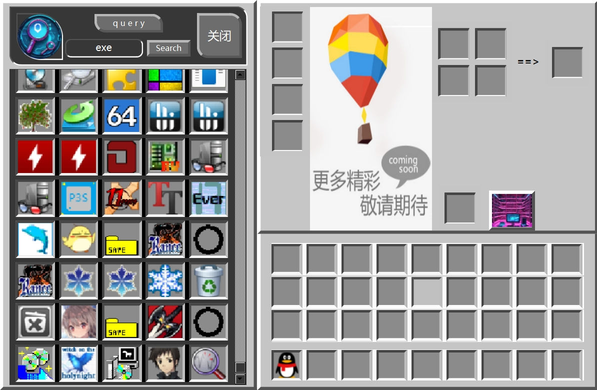

*Current language：English*
 
*Switch to **[Chinese](https://github.com/capp-adocia/HMCW/blob/main/README.md)***
# HMCW

This is a desktop widget with a Minecraft style, similar to the Windows taskbar, that can be used to save and launch various programs. Although it doesn't have all the functions of the Windows taskbar, it can be considered a simplified version. Additionally, I've added some extra features to this tool, such as program file search and scheduled breaks. If you're interested, why not give it a try!

## Statement

- *This software is open-source and free to use. I strongly oppose any individual or organization using this software for commercial purposes and charging fees. Should you encounter anyone charging for this software in any form, please contact me.*
- **This software is currently only available for the Windows platform, with other platforms not considered at the moment. Stay tuned...**

## Introduction && User Guide

- Simply put, it consists of three main functional modules:
>
> - Inventory Bar at Start
>>
>> 1. Accepts user-dragged shortcut files (.lnk) or executable files (.exe) into each item slot.
>> 2. Clicking an icon directly opens the corresponding .exe file, launching the program.
>> 3. Above the inventory bar, there are indicators for health, hunger, and experience, which vary with work, rest, and usage duration.
>> 4. At rest times, a rest window pops up where you can choose to rest or skip.
>> 5. Pressing the 'H' key triggers a small surprise.
>>
> - Opening the Backpack with the 'E' Key
>>
>> 1. The left area is used to search and display icons and information for all .exe files on the local computer.
>> 2. The middle right area is a storage zone for occasionally used programs.
>> 3. The lower right area corresponds to the original inventory bar.
>> 4. To add a program, click an icon in the left area and then a slot in the right area to add a new .exe file. (Tip: To add new programs to the start inventory, you can add them to the character's item bar on the right.)
>>
> - Opening the Settings Interface from the Far-Right Slot of the Inventory Bar (or by Pressing ESC)
>>
>> 1. Progress displays achieved milestones.
>> 2. Report Bugs allows users to submit software bugs.
>> 3. Provide Feedback enables users to offer suggestions.
>> 4. Statistics gather some interesting data.
>> 5. Options... adjust the timer settings.
>> 6. About displays the current information you are reading (jokingly).

## Run screenshot

1. Inventory
2. Backpack
3. Inventory and Backpack
4. Menu
5. Achievement

## Developer Reflections

- Although this might look like a software designed for interacting with desktop programs, its main function is actually a timer. I don't know why I'm so fond of timers. I've created three small timer programs before, but none of them really made people want to use them. However, this software, even for someone like me who hasn't played Minecraft in a long time, sparks an endless desire to explore. I believe the development concept behind this software is definitely solid.
- Initially, I didn't come up with the idea to develop this style of program on my own. I just wanted to write a timer application and practice some C++ programming skills. By chance, I came across a Bilibili creator, *沫狐奶昔CimiMoly*, who developed a Minecraft-styled desktop tool using WinAPI. This sparked my inspiration, and I wanted to try developing a similar style of program. Thanks to *沫狐奶昔CimiMoly* for the share, which gave me this creative idea.
- On a whim, I decided to develop one using Qt. I thought it would be a fleeting interest, but surprisingly, I kept at it off and on for a month.
- I've managed to complete most of the basic functionalities, but there's still a lot to adjust and improve. The style also needs further beautification, mostly inspired by Minecraft's design. In the future, when time allows, I plan to add some sound effects, like button clicks, to enhance the user experience.
- This software is the result of my continuous effort, investing a lot of time and energy. I can't guarantee future updates, as that will entirely depend on luck and my schedule.
- If you find my work helpful and wish to continue receiving my support, please consider sponsoring me. Your sponsorship will help me continue to provide high-quality services and support. Thank you for your support and attention.

## Contact Information

- QQ: Please contact me at 2636427505.
- QQ email: Please send an email to [2636427505@qq.com](https://mail.qq.com/) to contact me.
- Bilibili: **是Kapa呀**(Those interested can follow(๑•́ ₃ •̀๑)ｴｰ)
- ......

## Sponsorships and Donations

**WeChat** or **Alipay**
Note: If the image does not load, please enable the accelerator, otherwise the image will not load.

                
